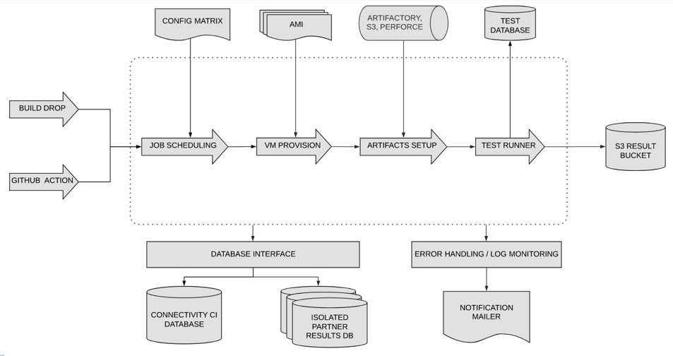
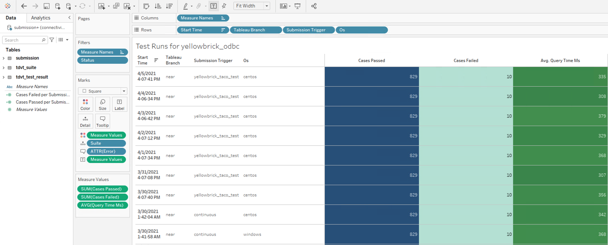

The Continuous Integration (CI) Pipeline can test TACO files across many environments, including multiple operating systems, databases, driver versions, and Tableau versions. It allows you to debug on machines where errors happen and provides messages to identify and help debug specific issues.

## Benefits of the CI pipeline

The Connectivity CI pipeline lets you:

* Use distributed test suites across machines.
* Run each test suite in a clean environment.
* Test a broad matrix of operating systems, databases, drivers, Tableau versions, and TACO files.
* Run and get results from the Tableau Data Source Verification Tool (TDVT) test suite, usually within 10 minutes.
* Bubble up actionable log messages.
* Save the machine state when there’s a failure to help with diagnostics.
* Test partner-built connectors on demand.
* Analyze test results in Tableau. This allows you to prioritize how to fix failing tests, identify longest running test suite, detect test cases failing across all operating systems, and compare runs across various driver versions.
* Isolate partner test results in a separate database.

## Your repository

This GitHub repository (repo) is for your CI pipeline. The repo is for your resources (TACO files, related drivers, install script for the driver, TDS files that contain credentials to access your database, etc.).

This repository has [triggers](https://docs.github.com/en/actions/reference/events-that-trigger-workflows) for [GitHub actions](https://docs.github.com/en/actions/learn-github-actions/introduction-to-github-actions) that we set up in advance. These triggers run CI validation flows for your drivers and TACO connectors.

The repo also contains the configuration file for your CI TACO pipeline. This file, `ci.json`, points to your connector artifacts, drivers, and TDVT running setup. The `ci.json` file configures a group of resources that GitHub action workflow will pick up for running a CI validation workflow.

The [GitHub action workflow](https://docs.github.com/en/actions/reference/workflow-syntax-for-github-actions) uses your `ci.json` file to run validation workflow. The following is a sample configuration file.
<a id="config_file"></a>
```json
    {
    "connector": {
      "connector-file-path": "taco/memsql-packaged/connector/MEMSQLTACOPACKAGED.taco"
    },
    "driver": {
      "skip": false,
      "type": "odbc",
      "driver-file-path": "taco/memsql-packaged/driver/centos/mysql-connector-odbc-8.0.13-1.el7.x86_64.rpm",
      "setup-script-file-path": "taco/memsql-packaged/driver/centos/partnerODBCSetup-centos.sh",
      "driver-dependency-files-path": [
          "taco/memsql-packaged/driver/centos/libmyodbc8w.so"
          "taco/memsql-packaged/driver/centos/partnerODBCConfig.ini"
      ]
    },
    "os": "centos",
    "builds": [
      "near"
    ],
    "tdvt": {
      "skip": false,
      "connector-name": "memsql_taco_packaged",
      "test-suite-name": "MEMSQLTACOPACKAGED",
      "test-config-files-path": [
        "taco/memsql-packaged/tdvt/config/MEMSQLTACOPACKAGED.ini"
      ],
      "tds-files-path": [
        "taco/memsql-packaged/tdvt/tds/cast_calcs.MEMSQLTACOPACKAGED.tds",
        "taco/memsql-packaged/tdvt/tds/Staples.MEMSQLTACOPACKAGED.tds"
      ],
      "password-files-path": [
          "taco-memsql-packaged/tdvt/password/MEMSQLTACOPACKAGED_badpassword.password",
          "taco-memsql-packaged/tdvt/password/MEMSQLTACOPACKAGED.password"
      ]
    },
    "docker-db": {
      "skip": true,
      "file-path": "",
      "setup-script-file-path": ""
    },
    "result-receiver": [
      "ConnectivityCI@tableau.com"
    ]
  }
```

## How the CI pipeline works

To configure a specific run, use your configuration file (`ci.json`). If you want to test various configuration versions, you can create several configuration files to define each unique set of options.

When you are ready to run a test using the CI Pipeline, you add a release tag to your repository to trigger a GitHub action. GitHub action copies your resources into an Amazon S3 bucket for use by the CI pipeline.



The workflow consists of the following actions:
1. Set up job
2. Workflow setup
3. Validate CI configuration
4. Upload artifacts to Amazon S3
5. Show reference information
6. Post-workflow setup
7. Complete job

## Configure your CI pipeline

You can make changes to your repository locally or in the GitHub UI. To make your changes locally, [clone](https://docs.github.com/en/github/creating-cloning-and-archiving-repositories/cloning-a-repository-from-github/cloning-a-repository) this repository to your device.

### Step 1: Add your resources
Add each resource listed below to its associated folder, where `<connector_folder>` is the name of your connector.

| Resource      | Directory |
| ----------- | ----------- |
| TACO file      | `taco/<connector_folder>/connector`       |
| Driver file   | `taco/<connector_folder>/driver/<os>`        |
| Setup script | `taco/<connector_folder>/driver/<os>` |
| Driver dependency files  | `taco/<connector_folder>/driver/<os>`  |
| Test configuration files  |  `taco/<connector_folder>/tdvt/config` |
| Calcs and staples tables  | `taco/<connector_folder>/tdvt/tds`  |
| Password files  | `taco/<connector_folder>/tdvt/password`  |
| (optional) Docker DB file  | `taco/<connector_folder>/docker`  |
| (optional) Docker setup script | `taco/<connector_folder>/docker`  |

### Step 2: Edit your configuration file

1. Open the `ci-default.json` file.
2. Edit the following key-value pairs to reflect your resources:
   | Key | Value |
   | --- | ------ |
   | `connector-file-path`   | Path to your TACO file |
   |`driver-file-path`  | Path to your driver file |
   | `setup-script-file-path` | Path to your setup script file |
   | `driver-dependency-files-path` | Path to your dependency files |
   | `connector-name` | Name of the your connector |
   | `test-suite-name` | Test suite name |
   | `test-config-files-path` | Path to your configuration file |
   | `tds-files-path` | Path to your TDS files  |
   | `password-files-path` | Path to your password files (need to explain) |
   | `file-path` | Path to your Docker DB |
   | `setup-script-file-path` |Path to your Docker setup script  |

3. Save the file as `ci.json`.
4. Repeat for any other connector.

To see an example of the finished configuration file, see the <a href="#config_file">example cs.json</a> file.

### Step 3: Get your changes in the repo

If you are making changes locally, [commit](https://docs.github.com/en/desktop/contributing-and-collaborating-using-github-desktop/making-changes-in-a-branch/committing-and-reviewing-changes-to-your-project) and [push](https://docs.github.com/en/desktop/contributing-and-collaborating-using-github-desktop/making-changes-in-a-branch/pushing-changes-to-github) your changes to GitHub.

If you are making changes in the GitHub UI, add a description of your changes in the **Commit changes** area and click the **Commit changes** button.

## Create a release

## Verify results

To verify your results, you can do either of the following:

* Use the validation result email to get the submission ID.

* Use the Tableau workbook.

