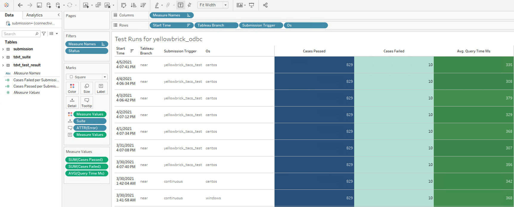

## Create a release
When you [create a tag](https://docs.github.com/en/desktop/contributing-and-collaborating-using-github-desktop/managing-commits/managing-tags) for your ????, you start the CI pipeline. The results of the

## Monitor the job

## Verify the results

To verify your results, you can do either of the following:

* Use the validation result email to get the submission ID.

* Use the Tableau workbook.

